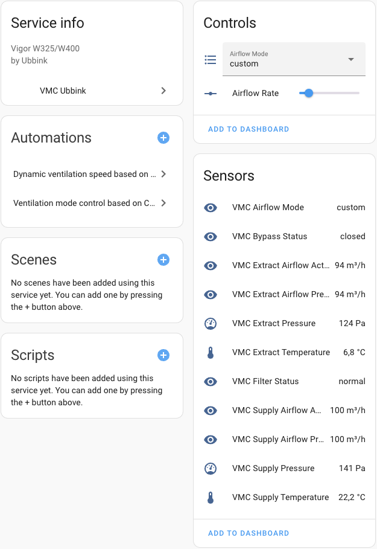

# VMC Ubbink Ubiflux Vigor Home Assistant Integration

This integration allows you to connect and control your **Ubbink Ubiflux Vigor** ventilation system (**W325 or W400**) from Home Assistant.

---

## 📌 Important: Requires a Server (included in this repo) for Modbus RTU Connection
This integration requires a **Python server** running in a **Docker container**, which:
- Reads data from the Ubiflux system using **Modbus RTU**.
- Provides a **REST API** for Home Assistant to access and control the ventilation system.

### 🔹 Where to Install the Server
The server can be installed on:
- **A separate device** (e.g., NAS, Raspberry Pi, Linux machine).
- **The same machine as Home Assistant** (if it supports Docker).

The server code is based on [pyubbink](https://github.com/asillye/pyubbink). Please check its documentation for details on **connecting to the Ubiflux device via Modbus**.

---

## 🚀 Installation Guide
### **1️⃣ Install the Ubbink Server**
Run the following commands on a device with **Docker & Docker Compose**:

```sh
git clone https://github.com/dimgen/homeassistant-vmc-ubbink.git
cd homeassistant-vmc-ubbink/ubbink-server
docker-compose up --build -d
```

By default, the server exposes an API on **port 8085** (configurable via `.env`).

### **2️⃣ Install the Home Assistant Integration**
#### Option A) **Via HACS**
1. Open **HACS** in Home Assistant.
2. Go to **Integrations** → Click **Custom Repositories**.
3. Add `https://github.com/dimgen/homeassistant-vmc-ubbink` and select Type **Integration**.
4. Click **Add**.
5. Restart Home Assistant.

#### Option B) **Manual Installation**
1. Download this repository and place `custom_components/vmc_ubbink` inside Home Assistant's `custom_components` folder.
2. Restart Home Assistant.

---

## 🔧 Configuration
### **1️⃣ Add Integration in Home Assistant**
1. Go to **Settings** → **Devices & Services**.
2. Click **+ Add Integration** → Search for **VMC Ubbink Ubiflux**.
3. Enter the connection details:
    - **Server Host** (IP/hostname of the Ubbink server)
    - **Server Port** (default: `8085`)
    - **Username & Password** (from `.env` file in the server)
4. Click **Submit**.

### **2️⃣ Devices & Controls**
Once added, Home Assistant recognizes **VMC Ubiflux as a single device** with the following features:

#### ✅ **Sensors (Read-only)**
| Name                      | Entity ID                         | Unit |
|---------------------------|----------------------------------|------|
| **Supply Temperature**     | `sensor.vmc_supply_temperature` | °C   |
| **Supply Pressure**        | `sensor.vmc_supply_pressure`    | Pa   |
| **Supply Airflow Actual**  | `sensor.vmc_supply_airflow_actual` | m³/h |
| **Supply Airflow Preset**  | `sensor.vmc_supply_airflow_preset` | m³/h |
| **Extract Temperature**    | `sensor.vmc_extract_temperature` | °C   |
| **Extract Pressure**       | `sensor.vmc_extract_pressure` | Pa   |
| **Extract Airflow Actual** | `sensor.vmc_extract_airflow_actual` | m³/h |
| **Extract Airflow Preset** | `sensor.vmc_extract_airflow_preset` | m³/h |
| **Airflow Mode**           | `sensor.vmc_airflow_mode`      |      |
| **Bypass Status**          | `sensor.vmc_bypass_status`     |      |
| **Filter Status**          | `sensor.vmc_filter_status`     |      |
| **Serial Number**          | `sensor.vmc_serial_number`     |      |

#### ✅ **Controls**
| Name               | Entity ID                 | Type    | Options / Range |
|--------------------|--------------------------|---------|-----------------|
| **Airflow Mode**   | `select.vmc_airflow_mode` | Select  | `wall_unit`, `holiday`, `low`, `normal`, `high` |
| **Airflow Rate**   | `number.vmc_airflow_rate` | Number  | `50-400` m³/h |



#### Sample Automations
#### 1. Set airflow speed based on CO2 sensor (linear interpolation)
```yaml
alias: Update VMC airflow speed based on CO2
description: Linearly adjusts ventilation speed (50–220) based on CO2 (to be in range 550-1000).
triggers:
  - entity_id: sensor.max_co2
    trigger: state
conditions: []
actions:
  - variables:
      co2_value: "{{ states('sensor.max_co2') | float(0) }}"
  - variables:
      new_speed: >-
           

        
          {{ min_speed }}
        
          {{ max_speed }}
        
          
          {{ interpolated | round(0) }}
        
  - choose:
      - conditions:
          - condition: template
            value_template: |
              {{ states('number.airflow_rate') | float(0)
                 != new_speed | float(0) }}
        sequence:
          - target:
              entity_id: number.airflow_rate
            data:
              value: "{{ new_speed }}"
            action: number.set_value
mode: single
```

#### 2. Set airflow speed (100–220, steps of 5) based on CO2 sensor with steps of 5
```yaml
alias: Update VMC airflow speed based on CO2
description: >-
  Linearly adjusts ventilation speed (100–220, steps of 5) based on CO2
  (600–1000).
triggers:
  - entity_id: sensor.max_co2
    trigger: state
conditions: []
actions:
  - variables:
      co2_value: "{{ states('sensor.max_co2') | float(0) }}"
  - variables:
      new_speed: >-
           

        
          {{ min_speed }}
        
          {{ max_speed }}
        
          
          {{ ((interpolated / 5) | round(0) * 5) | int }}
        
  - choose:
      - conditions:
          - condition: template
            value_template: |
              {{ states('number.airflow_rate') | float(0)
                 != new_speed | float(0) }}
        sequence:
          - target:
              entity_id: number.airflow_rate
            data:
              value: "{{ new_speed }}"
            action: number.set_value
mode: single
```

#### 3. Set mode based on CO2 sensor (>= 1000 - high, >= 800 - normal, >= 600 - low, < 600 - holiday)
```yaml
alias: Update VMC mode based on CO2
description: Sets airflow mode based on maximum CO2.
triggers:
  - entity_id: sensor.max_co2
    trigger: state
conditions: []
actions:
  - choose:
      - conditions:
          - condition: numeric_state
            entity_id: sensor.max_co2
            above: 1000
        sequence:
          - choose:
              - conditions:
                  - condition: template
                    value_template: "{{ states('sensor.airflow_mode') != 'high' }}"
                sequence:
                  - target:
                      entity_id: select.airflow_mode
                    data:
                      option: high
                    action: select.select_option
          - stop: CO2 above 1000 - done.
      - conditions:
          - condition: numeric_state
            entity_id: sensor.max_co2
            above: 800
        sequence:
          - choose:
              - conditions:
                  - condition: template
                    value_template: "{{ states('sensor.airflow_mode') != 'normal' }}"
                sequence:
                  - target:
                      entity_id: select.airflow_mode
                    data:
                      option: normal
                    action: select.select_option
          - stop: CO2 above 800 - done.
      - conditions:
          - condition: numeric_state
            entity_id: sensor.max_co2
            above: 600
        sequence:
          - choose:
              - conditions:
                  - condition: template
                    value_template: "{{ states('sensor.airflow_mode') != 'low' }}"
                sequence:
                  - target:
                      entity_id: select.airflow_mode
                    data:
                      option: low
                    action: select.select_option
          - stop: CO2 above 600 - done.
    default:
      - choose:
          - conditions:
              - condition: template
                value_template: "{{ states('sensor.airflow_mode') != 'holiday' }}"
            sequence:
              - target:
                  entity_id: select.airflow_mode
                data:
                  option: holiday
                action: select.select_option
mode: single
```

---

## 🛠 Troubleshooting
### ❌ Connection Issues
- Ensure the Ubbink Server is **running and accessible** from Home Assistant.
- Check if the **correct host/port** is entered in the integration settings.
- View server logs:
  ```sh
  docker logs ubbink-server
  ```

### ❌ Data Not Updating
- Restart Home Assistant after adding the integration.
- Check the API response manually:
  ```sh
  curl -u admin:secret http://server-ip:8085/data
  ```

---

## 📜 License
This project is licensed under the **MIT License**.

## 👨‍💻 Contributing
Pull requests are welcome! If you find issues, feel free to open an [issue](https://github.com/dimgen/homeassistant-vmc-ubbink/issues).

