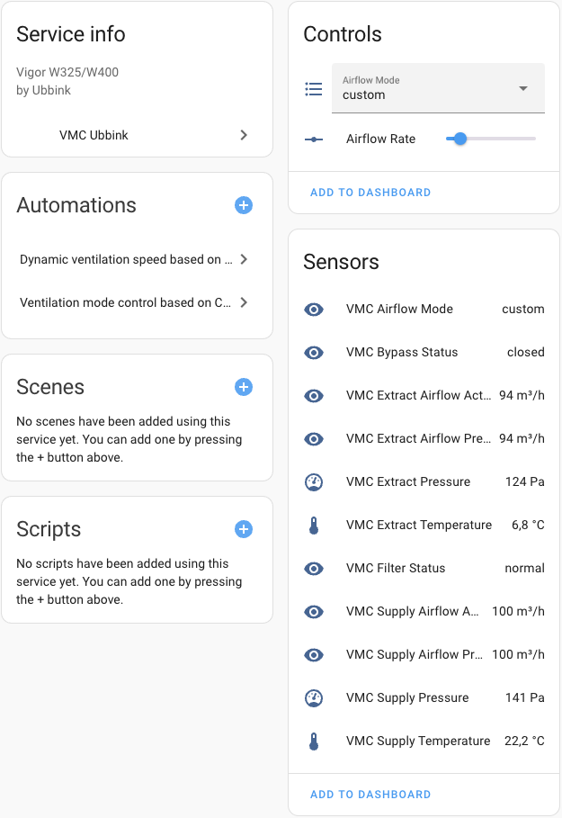

# VMC Ubbink Ubiflux Vigor Home Assistant Integration

This integration allows you to connect and control your **Ubbink Ubiflux Vigor** ventilation system (**W325 or W400**) from Home Assistant.

[](https://my.home-assistant.io/redirect/hacs_repository/?owner=dimgen&repository=homeassistant-vmc-ubbink&category=integration)

> **Install via HACS** for one-click setup and update notifications — click the badge above. Details below.

---

## 🔀 Two connection modes

This integration supports **two ways** to talk to the VMC. You pick one when adding
the integration, and can switch later via **Settings → Devices & Services → VMC
Ubbink → Configure** (switching keeps your entities and history).

### Direct (Waveshare RS485-to-ETH) — no extra device
Home Assistant talks to the VMC directly over your network through an Ethernet-to-RS485
gateway (e.g. **Waveshare RS485 to ETH (B)**). No Docker, no separate host.

Gateway setup (Waveshare, "transparent"/RTU mode):
- Baudrate **19200**, data **8**, parity **None**, stop **1** (8N1)
- Work mode: **TCP Server**, protocol: transparent (raw RTU over TCP)
- Note the gateway **IP** and **TCP port** (default `502`)
- Wire RS485 to the VMC's red Modbus port X15: **A→2, B→3, GND→1**

Then add the integration → choose **Direct**, enter the gateway IP, TCP port (`502`),
and the Modbus slave address (default `20`).

### Server (HTTP) — original mode
Runs the included Python server (`ubbink-server`) in Docker; Home Assistant talks to it
over HTTP. See the server setup below. Existing installs keep working unchanged.

---

## 📦 Installation

### 1️⃣ Install the integration

#### Option A — HACS (recommended; gets update notifications)

[](https://my.home-assistant.io/redirect/hacs_repository/?owner=dimgen&repository=homeassistant-vmc-ubbink&category=integration)

1. Click the button above — it opens **HACS** on your Home Assistant, pre-filled with this repository.
2. Click **Download**, then **restart Home Assistant**.

*(Once the integration is accepted into the HACS default store you'll also be able to just search for **VMC Ubbink** in HACS. Until then, the button adds it as a custom repository — updates still work the same way.)*

#### Option B — Manual

1. Copy `custom_components/vmc_ubbink` from this repository into your Home Assistant `config/custom_components/` folder.
2. Restart Home Assistant.

*(Manual installs don't receive update notifications — HACS is recommended.)*

### 2️⃣ Set up the connection

- **Direct (Waveshare RS485-to-ETH)** — no extra software. Just configure the gateway as described under [🔀 Two connection modes](#-two-connection-modes) above.
- **Server (HTTP)** — additionally run the bundled Python server (Docker), which bridges Modbus RTU to a REST API:

  ```sh
  git clone https://github.com/dimgen/homeassistant-vmc-ubbink.git
  cd homeassistant-vmc-ubbink/ubbink-server
  docker compose up --build -d
  ```

  By default the server exposes its API on **port 8085** (configurable via `.env`). The server code is based on [pyubbink](https://github.com/asillye/pyubbink).

---

## 🔧 Configuration
### **1️⃣ Add Integration in Home Assistant**
1. Go to **Settings** → **Devices & Services**.
2. Click **+ Add Integration** → search for **VMC Ubbink**.
3. Choose the connection mode and enter its details:
    - **Direct** — Waveshare gateway **IP**, **TCP port** (`502`), and **Modbus slave id** (`20`).
    - **Server** — server **host**, **port** (`8085`), and **username/password** (from the server `.env`).
4. Click **Submit**. You can switch the mode later via **Configure** without losing history.

### **2️⃣ Devices & Controls**
Once added, Home Assistant recognizes **VMC Ubiflux as a single device** with the following features:

#### ✅ **Sensors (Read-only)**
| Name                      | Entity ID                         | Unit |
|---------------------------|----------------------------------|------|
| **Supply Temperature**     | `sensor.vmc_supply_temperature` | °C   |
| **Supply Pressure**        | `sensor.vmc_supply_pressure`    | Pa   |
| **Supply Airflow Actual**  | `sensor.vmc_supply_airflow_actual` | m³/h |
| **Supply Airflow Preset**  | `sensor.vmc_supply_airflow_preset` | m³/h |
| **Extract Temperature**    | `sensor.vmc_extract_temperature` | °C   |
| **Extract Pressure**       | `sensor.vmc_extract_pressure` | Pa   |
| **Extract Airflow Actual** | `sensor.vmc_extract_airflow_actual` | m³/h |
| **Extract Airflow Preset** | `sensor.vmc_extract_airflow_preset` | m³/h |
| **Airflow Mode**           | `sensor.vmc_airflow_mode`      |      |
| **Bypass Status**          | `sensor.vmc_bypass_status`     |      |
| **Filter Status**          | `sensor.vmc_filter_status`     |      |
| **Serial Number**          | `sensor.vmc_serial_number`     |      |

#### ✅ **Controls**
| Name               | Entity ID                 | Type    | Options / Range |
|--------------------|--------------------------|---------|-----------------|
| **Airflow Mode**   | `select.vmc_airflow_mode` | Select  | `wall_unit`, `holiday`, `low`, `normal`, `high` |
| **Airflow Rate**   | `number.vmc_airflow_rate` | Number  | `50-400` m³/h |



#### Sample Automations
#### 1. Set airflow speed based on CO2 sensor (linear interpolation)
```yaml
alias: Update VMC airflow speed based on CO2
description: Linearly adjusts ventilation speed (50–220) based on CO2 (to be in range 550-1000).
triggers:
  - entity_id: sensor.max_co2
    trigger: state
conditions: []
actions:
  - variables:
      co2_value: "{{ states('sensor.max_co2') | float(0) }}"
  - variables:
      new_speed: >-
           

        
          {{ min_speed }}
        
          {{ max_speed }}
        
          
          {{ interpolated | round(0) }}
        
  - choose:
      - conditions:
          - condition: template
            value_template: |
              {{ states('number.airflow_rate') | float(0)
                 != new_speed | float(0) }}
        sequence:
          - target:
              entity_id: number.airflow_rate
            data:
              value: "{{ new_speed }}"
            action: number.set_value
mode: single
```

#### 2. Set airflow speed (100–220, steps of 5) based on CO2 sensor with steps of 5
```yaml
alias: Update VMC airflow speed based on CO2
description: >-
  Linearly adjusts ventilation speed (100–220, steps of 5) based on CO2
  (600–1000).
triggers:
  - entity_id: sensor.max_co2
    trigger: state
conditions: []
actions:
  - variables:
      co2_value: "{{ states('sensor.max_co2') | float(0) }}"
  - variables:
      new_speed: >-
           

        
          {{ min_speed }}
        
          {{ max_speed }}
        
          
          {{ ((interpolated / 5) | round(0) * 5) | int }}
        
  - choose:
      - conditions:
          - condition: template
            value_template: |
              {{ states('number.airflow_rate') | float(0)
                 != new_speed | float(0) }}
        sequence:
          - target:
              entity_id: number.airflow_rate
            data:
              value: "{{ new_speed }}"
            action: number.set_value
mode: single
```

#### 3. Set mode based on CO2 sensor (>= 1000 - high, >= 800 - normal, >= 600 - low, < 600 - holiday)
```yaml
alias: Update VMC mode based on CO2
description: Sets airflow mode based on maximum CO2.
triggers:
  - entity_id: sensor.max_co2
    trigger: state
conditions: []
actions:
  - choose:
      - conditions:
          - condition: numeric_state
            entity_id: sensor.max_co2
            above: 1000
        sequence:
          - choose:
              - conditions:
                  - condition: template
                    value_template: "{{ states('sensor.airflow_mode') != 'high' }}"
                sequence:
                  - target:
                      entity_id: select.airflow_mode
                    data:
                      option: high
                    action: select.select_option
          - stop: CO2 above 1000 - done.
      - conditions:
          - condition: numeric_state
            entity_id: sensor.max_co2
            above: 800
        sequence:
          - choose:
              - conditions:
                  - condition: template
                    value_template: "{{ states('sensor.airflow_mode') != 'normal' }}"
                sequence:
                  - target:
                      entity_id: select.airflow_mode
                    data:
                      option: normal
                    action: select.select_option
          - stop: CO2 above 800 - done.
      - conditions:
          - condition: numeric_state
            entity_id: sensor.max_co2
            above: 600
        sequence:
          - choose:
              - conditions:
                  - condition: template
                    value_template: "{{ states('sensor.airflow_mode') != 'low' }}"
                sequence:
                  - target:
                      entity_id: select.airflow_mode
                    data:
                      option: low
                    action: select.select_option
          - stop: CO2 above 600 - done.
    default:
      - choose:
          - conditions:
              - condition: template
                value_template: "{{ states('sensor.airflow_mode') != 'holiday' }}"
            sequence:
              - target:
                  entity_id: select.airflow_mode
                data:
                  option: holiday
                action: select.select_option
mode: single
```

---

## 💡 Good to know
### 📟 Connecting a wall unit (LCD controller or not) with this integration
You can use your **Ubbink Wall Controller** with this integration. However, it seems that the controller always has the priority. When you change the airflow on the controller, the integration's setting is bypassed.
Also, it seems that you cannot set an airflow lower than the controller's setting from the integration. The best is thus to set the controller on the minimal setting (eg: 1/4) and control the airflow via Hass. This provides a fallback via the wall unit.

---

## 🛠 Troubleshooting
### ❌ Connection Issues
- Ensure the Ubbink Server is **running and accessible** from Home Assistant.
- Check if the **correct host/port** is entered in the integration settings.
- View server logs:
  ```sh
  docker logs ubbink-server
  ```

### ❌ Parity Issues (No data)
- If you see errors such as `Error: [Input/Output] Modbus Error: [Invalid Message] No response received, expected at least 2 bytes (0 received)` in your server logs, that can be a parity issue.
- The integration is using **No parity**, but, by default the W400 seems to be configured with parity **Odd**.
- You should thus change the parity configuration in your machine's menu to use **No parity** : ⚙ ➤ 14. Communication ➤ 4. Parity ➤ No

### ❌ Data Not Updating
- Restart Home Assistant after adding the integration.
- Check the API response manually:
  ```sh
  curl -u admin:secret http://server-ip:8085/data
  ```

---

## 📜 License
This project is licensed under the **MIT License**.

## 👨‍💻 Contributing
Pull requests are welcome! If you find issues, feel free to open an [issue](https://github.com/dimgen/homeassistant-vmc-ubbink/issues).

